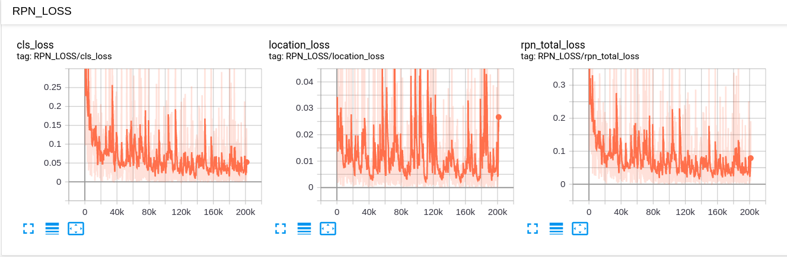
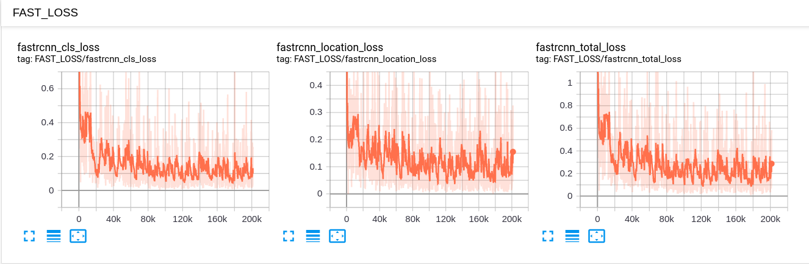
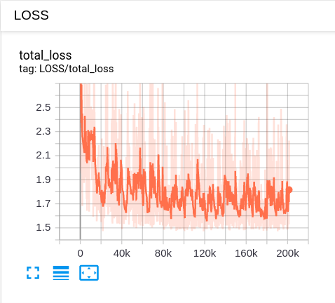
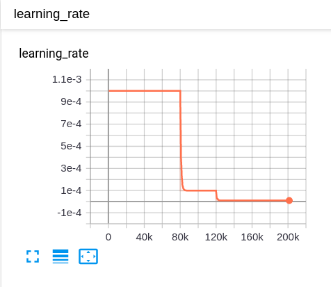
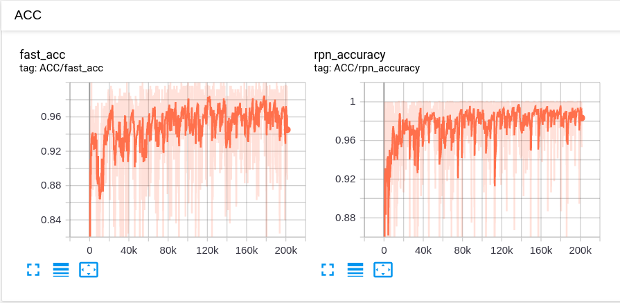

# Faster-RCNN-Tensorflow
Faster_RCNN Network

## compile for num and rpn 
```shell script
cd $PATH_ROOT/libs/box_utils/cython_utils
python setup.py build_ext --inplace
```

## Download Dataset
### Pascal Voc 2012
```shell script
$ wget http://host.robots.ox.ac.uk/pascal/VOC/voc2007/VOCtrainval_06-Nov-2007.tar
$ wget http://host.robots.ox.ac.uk/pascal/VOC/voc2012/VOCtrainval_11-May-2012.tar
$ wget http://host.robots.ox.ac.uk/pascal/VOC/voc2007/VOCtest_06-Nov-2007.tar
```
### COCO 2017
```shell script
$ wget http://images.cocodataset.org/annotations/annotations_trainval2017.zip
$ wget http://images.cocodataset.org/zips/train2017.zip
$ wget http://images.cocodataset.org/zips/val2017.zip
````
# pretrained weights
* <http://download.tensorflow.org/models/resnet_v1_101_2016_08_28.tar.gz>

## train logs

 |
|:-------------------------:|
Displayed one-state Loss on Tensorboard | 

 |
|:-------------------------:|
Displayed two-stage Loss on Tensorboard | 

      |  
:-------------------------:|:-------------------------:
Displayed Total Loss on Tensorboard |  Displayed Accuracy on Tensorboard

 |
|:-------------------------:|
Displayed Accuracy on Tensorboard | 


## TODO